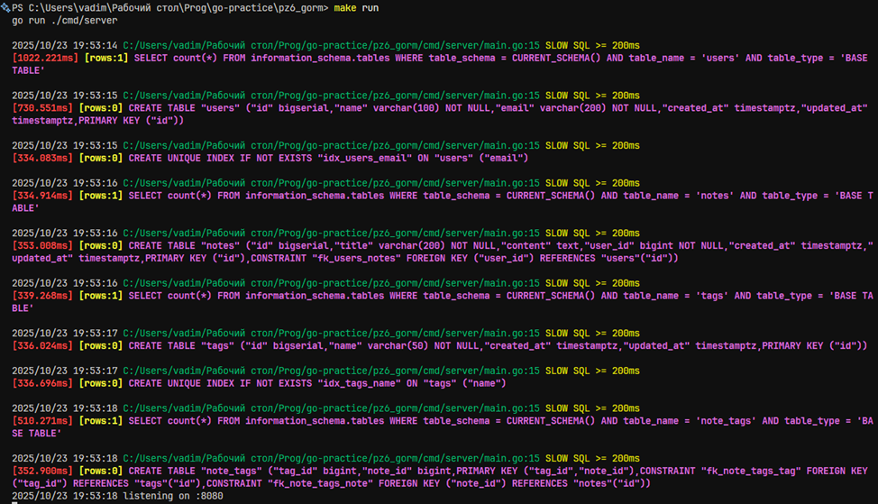
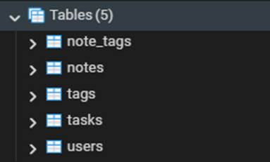
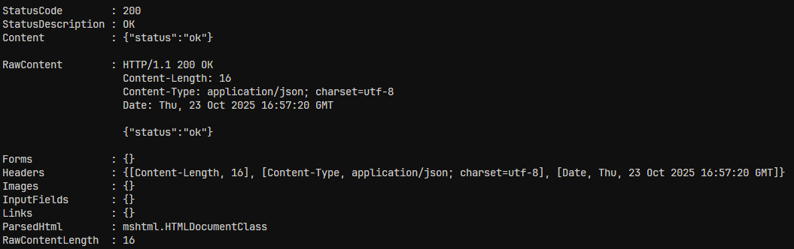
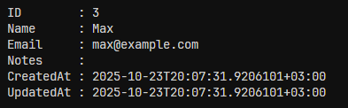
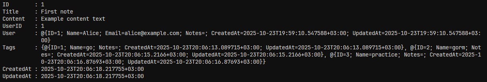

# Практическая работа № 6
Студент: Юркин В.И.

Группа: ПИМО-01-25

Тема: Использование ORM (GORM). Модели, миграции и связи между таблицами.

Цели:
- Понять, что такое ORM и чем удобен GORM.
- Научиться описывать модели Go-структурами и автоматически создавать таблицы (миграции через AutoMigrate).
- Освоить базовые связи: 1:N и M:N + выборки с Preload.
- Написать короткий REST (2–3 ручки) для проверки результата.

ORM (Object-Relational Mapping) позволяет работать с базой данных через объекты и структуры кода, не используя напрямую SQL-запросы. Благодаря этому код становится чище, понятнее и быстрее в разработке. GORM упростил создание моделей, миграций и связей между таблицами, позволив автоматически генерировать схему БД и выполнять CRUD-операции в несколько строк кода. Он также обеспечил безопасность за счёт параметризации запросов и ускорил работу с ассоциациями (1:N, M:N) через функции Preload и AutoMigrate

## Окружение
- Сервер: go 1.23.0 (Windows)
- БД: PostgreSQL 16.10 (Ubuntu 16.10-0ubuntu0.24.04.1)

## Скриншоты

### 1. Логи миграции (первой)



### 2. Результат миграции (первой) в pgAdmin



### 3. Проверка работы сервера
```bash
curl "http://localhost:8080/health"
```
Результат:



### 4. Создание пользователя
```bash
curl -Uri "http://localhost:8080/users" `
  -Method POST `
  -Headers @{ "Content-Type" = "application/json" } `
  -Body '{
    "name": "Max",
    "email": "max@example.com"
  }'

```
Результат:



### 5. Создание заметки
```bash
curl -Uri "http://localhost:8080/notes" `
  -Method POST `
  -Headers @{ "Content-Type" = "application/json" } `
  -Body '{
    "title": "First note",
    "content": "Example content text",
    "userId": 1,
    "tags": ["go", "gorm", "practice"]
  }'

```
Результат:



### 6. Получение заметки по ID
```bash
curl -Uri "http://localhost:8080/notes/1" -Method GET
```
Результат:


## Установка
Установка зависимостей
```bash
make install
```

### Отладка
Запуск проекта в режиме разработки
```bash
make run
```

### Билд
Билд проекта
```bash
make build
```
Запуск билда
```bash
.\server
```

## Конфигурация
Переменные окружения:
- DB_DSN - строка для подключения к БД (обязательный, пример "host=127.0.0.1 user=postgres password=postgres dbname=pz6_gorm port=5432 sslmode=disable")


